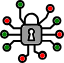

<header class="header text-center">
  

    

      <h1 class="logo">
        
        Ubiety SCRAM
      </h1>
    

    

      
Salted Challenge Response Authentication Mechanism for .NET Standard

    

    

      <a class="github-button" href="https://github.com/ubiety/Ubiety.Scram.Core" data-icon="octicon-star" data-size="large" aria-label="Star ubiety/Ubiety.Scram.Core on GitHub">Star</a>
      <a class="github-button" href="https://github.com/ubiety" data-size="large" aria-label="Follow @ubiety on GitHub">Follow @ubiety</a>
    

  

</header>

<section class="cards-section text-center">
  

    

      

        

          

            
          

          <h3 class="title">Get Started</h3>
          
Start using Ubiety SCRAM right away

          <a class="link" href="get-started.md"></a>
        

      

      

        

          

            
          

          <h3 class="title">API</h3>
          
API Documentation

          <a class="link" href="api/index.md"></a>
        

      

    

  

</section>
